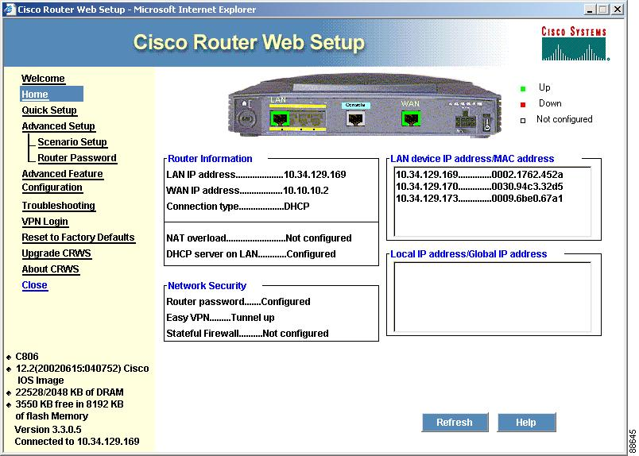

# RouterConfig

## Descrição

A configura

## Objetivo

Desenvolver uma aplicação utilizando o conhecimento adquirido na disciplina para criar ou excluir rotas no SO Linux e verificar o funcionamento das rotas existentes.

## Inspiração

... na **Figura 1**

*Figura 1 - Tela de Adição de Rota*

## Protótipos

## Comandos

## Instalação
