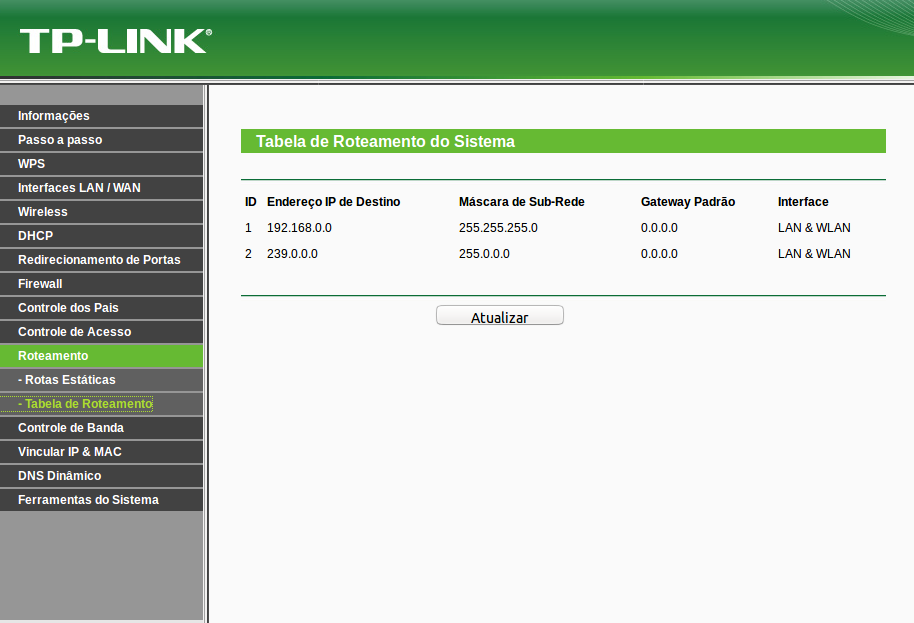
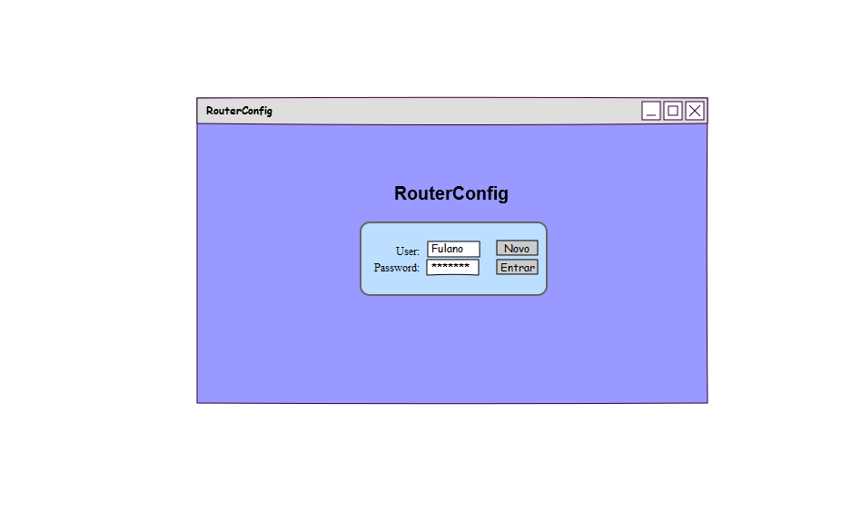
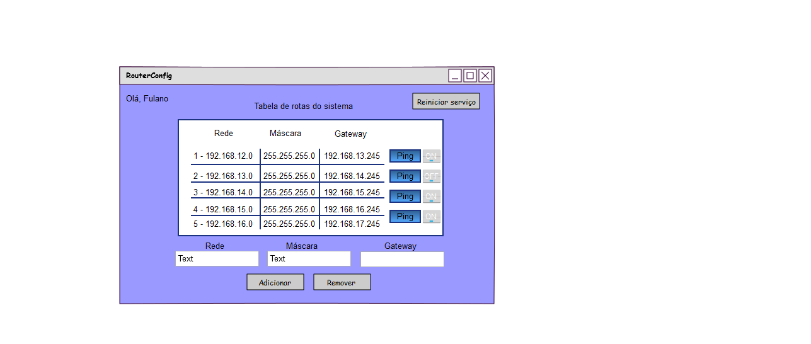

# RouterConfig

> Equipe: Suelando Alves 20141380351 e Higor Souza 20142380258

## Descrição

Aplicação desenvolvida para auxiliar analistas de redes em suas atividades de configuração e monitoramento de rotas. Através de uma aplicação web será possível obter uma aplicação servidora que ofereça suporte até para profissionais com pouco conhecimento téorico.

## Objetivo

Desenvolver uma aplicação utilizando o conhecimento adquirido na disciplina para criar ou excluir rotas no SO Linux e verificar o funcionamento das rotas existentes.

## Inspiração

A dificuldade em configurar uma rota em ambientes linux, estimula a desenvoler uma aplicação que torne mais fácil o aprendizado deste assunto nos cursos de redes de computadores. 

Com base nessa informação, nos baseamos página de adição de rotas obtida de um roteador TP-Link, como mostra a **Figura 1**.

*Figura 1 - Tela de Adição de Rota do TP-Link*

## Protótipos
*Figura 2 - Tela de login de usuário*

*Figura 3 - Tela com tabela de Monitoramento*

## Comandos utilizados

#### Ativar encaminhamento
>  echo "1" > /proc/sys/net/ipv4/ip_forward

### Visualizar tabela de rotas
> route -n

### Adicionar uma rota
> route add -net {$network} netmask {$netmask} gw {$gateway} dev {$interface}

### Apagar uma rota
> route del -net {$network} netmask {$netmask} gw {$gateway} dev {$interface}

## Instalação

Para o funcionamento desta aplicação será necessário um ambiente computacional com servidor web(apache) e banco de dados(MySQL).
Colocando estes serviços em funcionamento com todos os artefatos disponibilizados será possível obter o ambiente para qual foi desenvolvido. Em seguida, deverá fazer o download do diretório RouterConfig/ no link:
> ##### http://github.com/suelando/routerconfig

Copiar o conteúdo da pasta **code** para **/var/www/html/**

Adicionar um IP para que o serviço possa ser acessado remotamente.

No navegador web, digitar **Ip_da_máquina:8080//public/login.php**.
