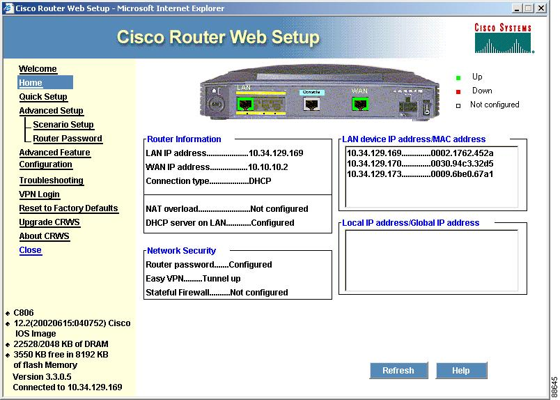

# RouterConfig

## Descrição

A configura

## Objetivo

Desenvolver uma aplicação utilizando o conhecimento adquirido na disciplina para criar ou excluir rotas no SO Linux e verificar o funcionamento das rotas existentes.

## Inspiração

... na **Figura 1**

*Figura 1 - Tela de Adição de Rota*

## Protótipos

## Comandos

#### Ativar encaminhamento
>  echo "1" > /proc/sys/net/ipv4/ip_forward

### Visualizar tabela de rotas
> route -n

### Adicionar uma rota
> route add -net {$network} netmask {$netmask} gw {$gateway} dev {$interface}

### Apagar uma rota
> route del -net {$network} netmask {$netmask} gw {$gateway} dev {$interface}

## Instalação
